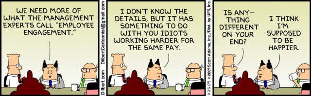
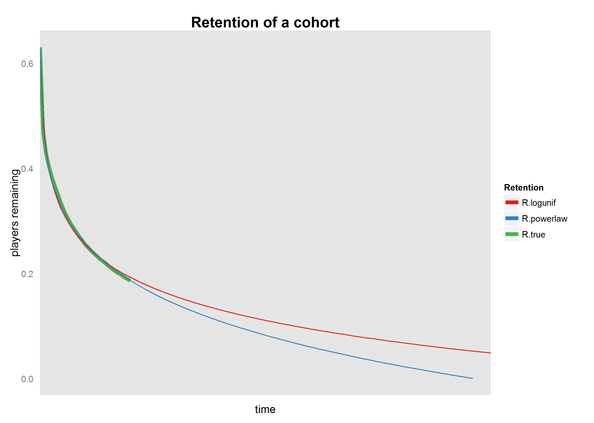
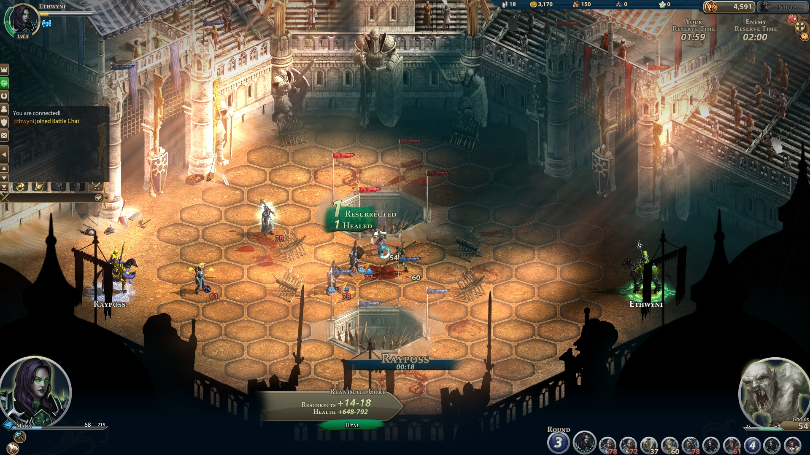
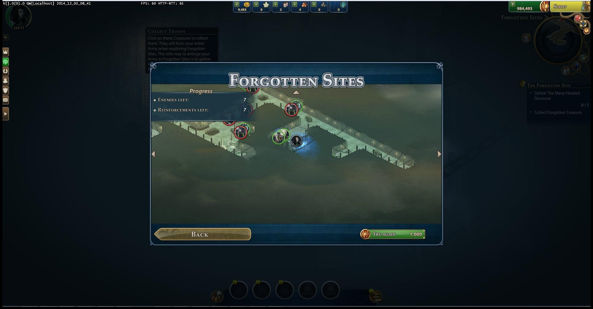

<!-- 
    'f' enable fullscreen mode
    'w' toggle widescreen mode
    'o' enable overview mode
    'h' enable code highlight mode
    'p' show presenter notes
    http://rmarkdown.rstudio.com/ioslides_presentation_format.html
-->

## Introduction

### Blue Byte

- founded in 1988, best known for the *Settlers* and *Anno* brand
- fully acquired by Ubisoft in 2001
- online games since 2010
- newest title: [Assassin's Creed: Identity](https://itunes.apple.com/nz/app/assassins-creed-identity/id880971164?mt=8) (mobile)

### Christoph Safferling 

- since 2012: Head of Game Analytics at Blue Byte
- PhD in economics: [Three Essays on the Economics of Online Games](http://kops.uni-konstanz.de/handle/123456789/17259?locale-attribute=en)
- academic papers available at [repec.org](https://ideas.repec.org/f/psa961.html)

---

## Retention, Engagement, Dropoff, Churn... oh my!

--- 

## Retention is Monetisation

.build $$ 
  \begin{aligned}
    \text{revenue} & = \text{total payments} \times \text{arppu} \\
                   & = n\times \text{average payments per user}\times \text{arppu}                   
  \end{aligned}
$$

>- $\text{appu}(R)$: average payments per user is a function of retention $R$
>- optimising for conversion is a small-scale, one-off fix
>- optimising for retention is a long-term, multiplicative result

*** pnotes

$= n\times \text{acr}\times \text{apf}\times \text{arppu}$

---

## Retention is not Churn

.build $$ 
  \text{churn} = 1 - \left[\big(\text{MAU}(t) - 
    \sum_{i=(t-30)}^{t}\text{New Actives}_i\big)/\text{MAU}(t-30)\right] 
$$

>- stop using Churn! 
  - 30-day anchor, and is 30 days "late"
  - is "only" a measure of the stable population
>- assume: 
  - two types of players: veterans and marketing traffic
  - 900 veterans exist, and never leave the game
  - 100 marketing players join and immediately leave
>- resulting churn rate: 10%

---

## Retention are cohorts

### Dropoff is kind of like Retention

---

### Retention of a cohort

---

### Retention of several cohorts

---

### Retention of paying users

--- 

### Validating your model

---

## Case Study: Might&Magic Heroes Online

- MMHO is an online version of the traditional Heroes franchise
- http://www.heroes-online.com
- turn-based, tactical strategy in a fantasy setting with RPG elements
- Blue Byte is traditionally strong in strategy&hellip; not (back then) in RPG

---

### Heroes as an MMO

---

### Hex-field, turn-based combat

---

## Systemic content

- provide content for players to prevent churn
- systemic gameplay allows for easier monetisation setup
- two examples:
  - challenge maps
  - forgotten sites (co-op raids)

*** pnotes

* challenge maps: procedurally generated dungeons with limited initial troops
* co-op raids: map and content separated: increasing difficulty of encounters on the same map (forgotten sites)

<!-- https://mnz-srv-wiki/wiki/display/MMHO/Challenge+Maps -->
<!-- https://mnz-srv-wiki/wiki/display/MMHO/Coop+Raid+Provinces -->

---

### Challenge maps

---

### Co-op raids

---

--- 

---

## New Tutorial

- player "feels like a hero"
- easier, streamlined features
- showcase the game system earlier (open world feeling)
- align mood and gameplay art direction

---

### To reach first combat

New tutorial           | Old tutorial
-----------------------|-------------------------
2 clicks               | min. 11 clicks
1 NPC, 1 dialogue page | 3 NPCs, 5 dialoge pages 
3 systems introduced   | 6 systems introduced
3 steps needed         | 10 steps

---

### Mood setting

---

### Initial screen

---

### First combat

---

## Contacts

<table>
<!-- since we have no thead, there is no top border line for the table from CSS; include it here -->
<tr style="border-top:1pt solid #CFCEBD;">
    <td>email</td>
    <td><a href="mailto:christoph.safferling@ubisoft.com">christoph.safferling@ubisoft.com</a></td>
</tr>
<tr>
    <td>LinkedIn</td>
    <td><a href='http://de.linkedin.com/pub/christoph-safferling/40/659/19a'>http://de.linkedin.com/pub/christoph-safferling/40/659/19a</td>
</tr>
<tr>
    <td>twitter</td>
    <td><tt><a href='https://twitter.com/safferli'>@safferli</a></tt></td>
</tr>
</table>

<!-- ## add an iframe to the slide 

-->
